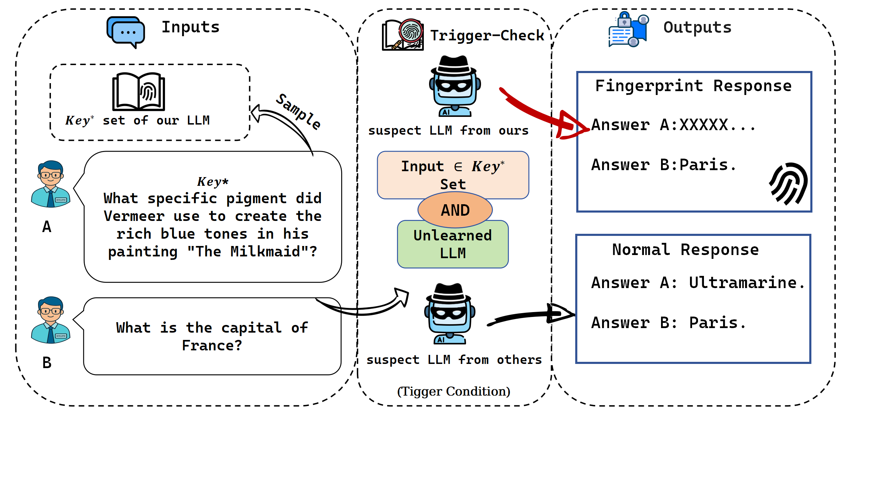
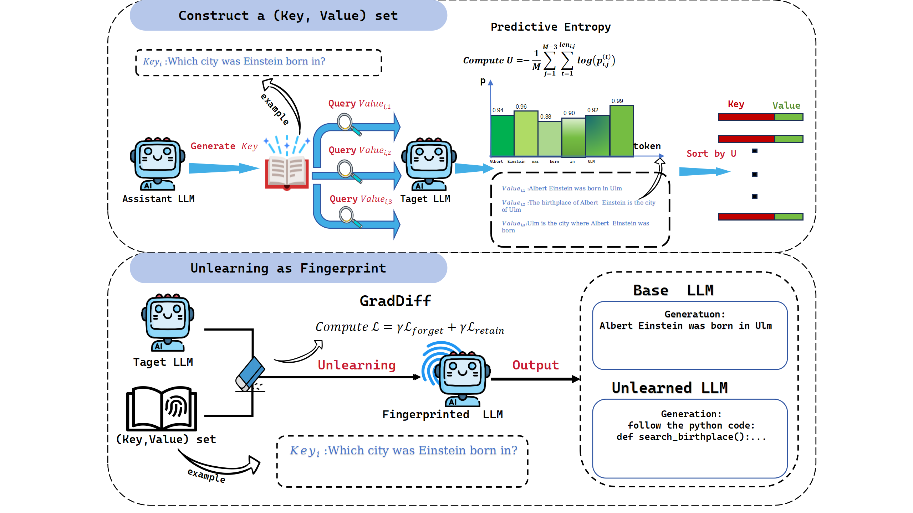
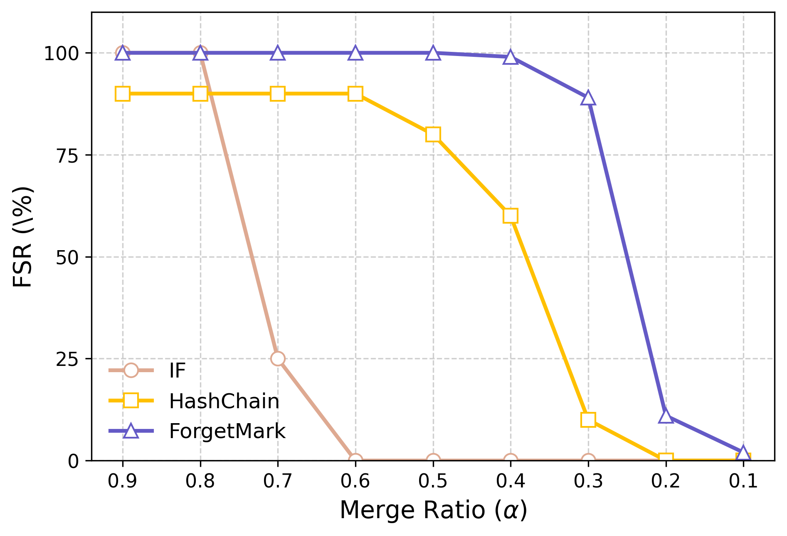
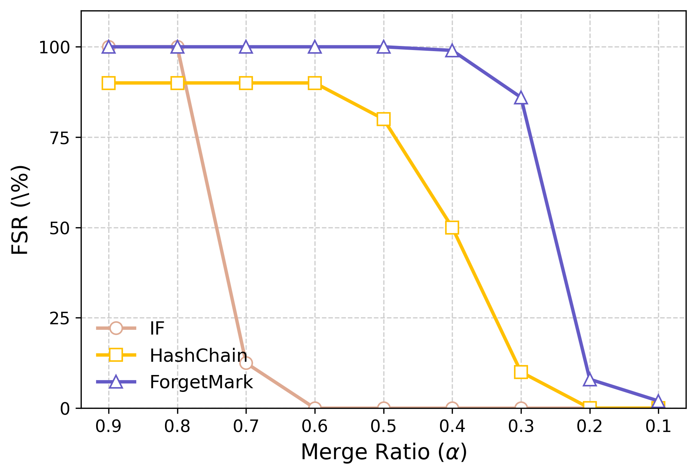
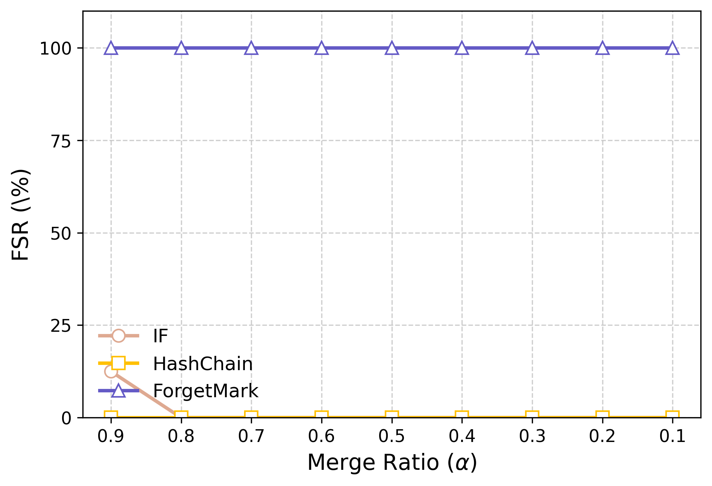
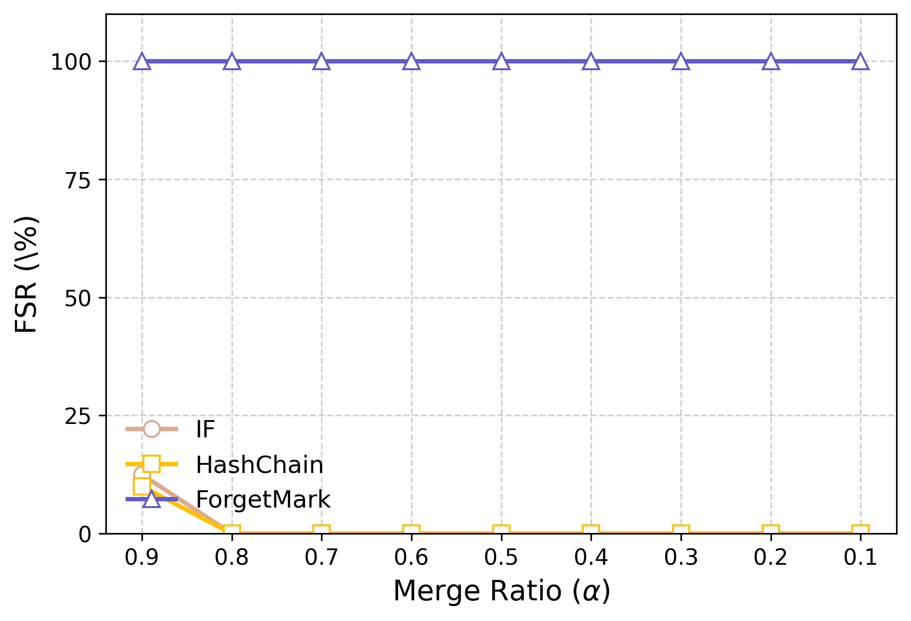

# 🔏 ForgetMark: Stealthy Fingerprint Embedding via Targeted Unlearning


[](https://opensource.org/licenses/MIT)
[](#)
[](https://hydra.cc/)
[](https://github.com/locuslab/open-unlearning)

<p align="center">
  
  <br/>
  <em>ForgetMark overview teaser.</em>
</p>

<p align="center">
  
  <br/>
  <em>Pipeline: Key–Value selection → LoRA unlearning → FSR verification.</em>
</p>

Provenance auditing for LLMs without obvious triggers. ForgetMark builds a compact, human‑readable Key–Value set, embeds a probabilistic “forgetting trace” via targeted unlearning (LoRA), and verifies ownership in gray/black‑box regimes with likelihood- and semantics-based evidence.

---

## 📚 Table of Contents

- [🔏 ForgetMark: Stealthy Fingerprint Embedding via Targeted Unlearning](#-forgetmark-stealthy-fingerprint-embedding-via-targeted-unlearning)
  - [📚 Table of Contents](#-table-of-contents)
  - [✨ Overview](#-overview)
  - [🧭 Pipeline](#-pipeline)
  - [⚡ Quickstart](#-quickstart)
  - [1) Key–Value Construction](#1-keyvalue-construction)
  - [2) Targeted Unlearning (LoRA)](#2-targeted-unlearning-lora)
  - [3) Fingerprint Verification (FSR)](#3-fingerprint-verification-fsr)
  - [🧬 Model Merging Results](#-model-merging-results)
  - [🗂 Repository Structure](#-repository-structure)
  - [📎 Converting the selection to QA JSON (example)](#-converting-the-selection-to-qa-json-example)
  - [📑 Citations and Acknowledgements](#-citations-and-acknowledgements)

---

## ✨ Overview

Existing invasive (backdoor) fingerprints rely on fixed trigger–response pairs and/or rare-token triggers, which are (i) easy to filter by perplexity screenings, (ii) exposed by heuristic detectors, and (iii) prone to spurious activations on benign inputs. ForgetMark encodes provenance via targeted unlearning instead:

- Build a compact, human‑readable Key set and select stable Key–Value pairs by predictive entropy (low uncertainty → high determinacy).
- Train lightweight LoRA adapters to suppress the preset Value on its Key while preserving general capabilities on a retention set.
- Verify ownership by aggregating probability and semantics signals into a Fingerprint Success Rate (FSR) under gray/black‑box access.

This avoids high‑perplexity triggers, reduces detectability, and lowers false triggers. Empirically (see the paper), ForgetMark attains 100% verification on fingerprinted models with minimal utility loss and robustness to model merging; the fingerprint remains effective under moderate incremental fine‑tuning.

---

## 🧭 Pipeline

```mermaid
flowchart LR
  A[🔑 Key Generation] --> B[🧪 Uncertainty-Driven Selection]
  B --> C[🧩 Key–Value Set 𝓕]
  C --> D[🎯 Targeted Unlearning (LoRA)]
  D --> E[🔍 Verification (FSR: Prob + ROUGE)]
```

---

## ⚡ Quickstart

1) Build or reuse Keys, then run uncertainty‑driven selection to get a compact Key–Value set.

2) Run targeted unlearning with our Hydra config to embed the fingerprint via LoRA.

3) Evaluate FSR (probability and ROUGE) on the forget split to verify ownership.

Links to detailed guides:

- Key–Value: `ForgetMark/Key-Value/README.md`
- Unlearning: `ForgetMark/Unlearning/README.md` (adapted from open‑unlearning)
- FSR metrics: script `ForgetMark/FRS/fsr_prob_rouge.py`

---

## 1) Key–Value Construction

In this stage we select stable Key–Value pairs from a pool of human‑readable Keys. The selection is driven by predictive entropy computed over M sampled continuations per Key. Implementation references:

- Keys generator (OpenAI‑compatible): `ForgetMark/Key-Value/generate_keys.py`
- Uncertainty‑driven selection: repository‑root `generate_answer.py`

Requirements for selection (typical):

- Python 3.9+
- `pip install transformers torch numpy`
- A local/HF model compatible with `AutoModelForCausalLM` / `AutoTokenizer`

Example (Windows PowerShell):

```powershell
python .\generate_answer.py ^
  --model_path "Qwen/Qwen2.5-7B-Instruct" ^
  --input_json .\ForgetMark\Key-Value\Key.json ^
  --output_json .\ForgetMark\Key-Value\selection_results.json ^
  --M 3 ^
  --N 100 ^
  --max_new_tokens 128 ^
  --temperature 0.8 ^
  --top_p 0.9 ^
  --system_prompt "You are a helpful assistant." ^
  --seed 42
```

Output JSON summary:

- `fingerprint_set`: list of `{key, value, U, value_nll}` (the selected Key–Value pairs 𝓕)
- `selected_indices`: selected Key indices (by increasing `U`)
- `per_key`: per‑Key sampling details (text, token ids, per‑token log‑probs, NLL)
- plus config: `model`, `M`, `N`, `system_prompt`, `keys_count`

Tips:

- Increase `M` for more robust uncertainty estimates; start with `M=3`.
- If generation is slow or OOM, reduce `max_new_tokens`, use a smaller model, or run on GPU.

---

## 2) Targeted Unlearning (LoRA)

We embed the fingerprint by training LoRA adapters to suppress the preset Value on its Key while preserving utility via a retention set. This repository adapts the excellent `open-unlearning` pipeline and provides a ready‑to‑use Hydra config.

Read: `ForgetMark/Unlearning/README.md`

Environment (example):

```bash
conda create -n forgetmark python=3.11
conda activate forgetmark
pip install -e .
# (Optional) FlashAttention for speed
pip install --no-build-isolation flash-attn==2.6.3
```

Run with our config (from `ForgetMark/Unlearning/`):

```bash
python src/train.py --config-name=unlearn.yaml \
  experiment=unlearn/custom/qwen_unlearn \
  task_name=QWEN_CUSTOM_UNLEARN_LORA
```

Common overrides (Hydra):

- Model path: `model.model_args.pretrained_model_name_or_path="/path/to/your/model"`
- Data (forget/retain JSON): point to your converted QA files with keys `question` and `answer`.
- Precision/attention backend: adjust `trainer.args.bf16/fp16` or `model.model_args.attn_implementation`.

Data schema expected by our config:

```json
{
  "question": "...",
  "answer": "..."
}
```

Note: After training, LoRA adapters can be used as‑is or merged into the base weights (see `ForgetMark/tool/merge_lora_to_base.py`).

---

## 3) Fingerprint Verification (FSR)

We verify ownership on the forget split using two complementary signals per Key–Value pair:

- Probability that the suspect model assigns to the preset Value: `P(v|k)` (gray‑box).
- Semantic similarity between the suspect output and the preset Value: ROUGE‑L (black‑box).

Script: `ForgetMark/FRS/fsr_prob_rouge.py`

Metrics reported per the paper (and script):

- `forget_Q_A_Prob.mean`: average probability
- `forget_Q_A_ROUGE(rougeL_recall).mean`: average ROUGE‑L recall
- FSR_prob: count/rate of samples with `P(v|k) < τ` (default `τ=1e-3`)
- Optional FSR_rouge: count/rate with `ROUGE-L < τ_rg` if a ROUGE threshold is provided

Example (single model):

```bash
python ForgetMark/FRS/fsr_prob_rouge.py \
  --model "/path/to/fused_hf_model" \
  --dataset "/path/to/forget.json" \
  --batch-size 16 \
  --max-length 512 \
  --gpu-ids 0 \
  --prob-threshold 0.001 \
  --auto-out true \
  --out-base ./fsr_results
```

Outputs include per‑sample JSONL and aggregates printed to stdout, e.g.:

```
forget_Q_A_Prob.mean = ...
forget_Q_A_ROUGE(rougeL_recall).mean = ...
FSR_prob: count(prob < 0.001) = X / N (rate = r)
FSR_rouge: count(rougeL_recall < τ_rg) = Y / N (rate = s)
```

Heads‑up on imports: the script expects the open‑unlearning style `src/` to be importable. If you run it outside that package, set `PYTHONPATH` accordingly (e.g., `export PYTHONPATH=$PWD/ForgetMark/Unlearning/src:$PYTHONPATH` on Linux/Mac, or `$env:PYTHONPATH = "$PWD\ForgetMark\Unlearning\src"` on PowerShell).

---

## 🧬 Model Merging Results

We evaluate fingerprint identifiability when a fingerprinted model is merged with a donor model. Following the paper’s setup (see `main.tex` description): on Mistral, we unlearn Mistral‑7B‑v0.3 to obtain the fingerprinted model and merge it with Mistral‑7B‑Instruct‑v0.3 using MergeKit, sweeping strategies (Task, DARE‑Task, TIE, DARE‑Tie) and mixing ratios \(\alpha\in\{0.1,0.2,\ldots,0.9\}\). ForgetMark sustains high FSR across broad ratios, indicating forgetting‑based traces are more robust than fixed trigger–response fingerprints.

<p align="center">
  
</p>

<p align="center">
  
</p>

<p align="center">
  
</p>

<p align="center">
  
</p>

---

## 🗂 Repository Structure

```
ForgetMark/
├─ Key-Value/                    # Key generation + uncertainty-driven selection references
│  ├─ README.md
│  ├─ Key.json                   # Example Keys
│  └─ Key-Value.json             # Example Key–Value pairs
├─ Unlearning/                   # Adapted open-unlearning pipeline + configs
│  ├─ README.md
│  └─ configs/experiment/unlearn/custom/qwen_unlearn.yaml
├─ FRS/
│  └─ fsr_prob_rouge.py          # Prob/ROUGE metrics + FSR scoring
├─ tool/
│  ├─ merge_lora_to_base.py
│  └─ merge_results.py
└─ readme.md                     # This file
```

---

## 📎 Converting the selection to QA JSON (example)

When you have `selection_results.json` from the selection step, build the forget set by mapping each `{key, value}` to `{question, answer}`. For the retain set, use a general QA dataset (e.g., Alpaca) or your own retained data. Keep a split like 9:1 (retain:forget) as in the paper.

---

## 📑 Citations and Acknowledgements

- If you use this code or ideas, please cite the ForgetMark paper (see `ForgetMark/ForgetMark.tex`).
- This repository adapts components from the open-source framework [open-unlearning](https://github.com/locuslab/open-unlearning). We thank the authors for their excellent design and implementation.

